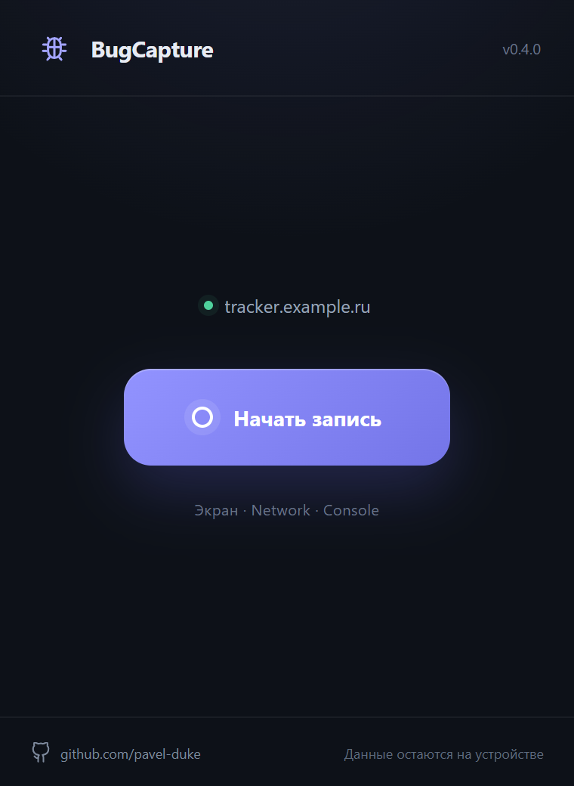

# BugCapture

Расширение для браузера, которое помогает собрать диагностику ошибки.

Нажимаешь запись, воспроизводишь проблему и получаешь видео, текстовый отчёт и очищенный HAR.

Работает локально и никуда не отправляет собранные данные.

[Скачать BugCapture](https://github.com/pavel-duke/bugcapture/releases/latest) · [Установка](INSTALL.md) · [Roadmap](docs/roadmap.md)

> BugCapture 0.3.0 получил минималистичный тёмный интерфейс: одна кнопка запуска, отметка момента во время записи и компактный экран результата.

Поддерживаемые браузеры:

- Яндекс Браузер;
- Google Chrome;
- Microsoft Edge;
- Chromium 116 и новее.

## Как выглядит расширение

До записи видны только текущая вкладка и одна главная кнопка. Во время записи доступны таймер, отметка момента и остановка. Интерфейс использует общую дизайн-систему с [ReqVault](https://github.com/pavel-duke/reqvault).



## Что умеет

- записывает видео текущей вкладки в WEBM;
- собирает метод, URL, статус, заголовки и время Network-запросов;
- собирает `console.error`, `console.warn`, ошибки страницы и необработанные Promise;
- определяет Яндекс Браузер, Chrome, Edge и версию браузера;
- создаёт понятный TXT-отчёт и совместимый с HAR 1.2 файл `*.safe.har`;
- автоматически скачивает три готовых файла после остановки;
- скрывает чувствительные заголовки, query-параметры и известные форматы секретов;
- работает без сервера, аккаунта, аналитики и телеметрии.

## Установка

Открой [последний GitHub Release](https://github.com/pavel-duke/bugcapture/releases/latest) и скачай файл вида:

```text
BugCapture-v0.3.0-chromium.zip
```

Не скачивай автоматически созданный GitHub файл `Source code.zip`: это исходники для разработчиков.

Распакуй архив и загрузи получившуюся папку в браузер. Подробные инструкции для каждого браузера находятся в [INSTALL.md](INSTALL.md).

## Быстрый старт

1. Открой страницу, на которой возникает проблема.
2. Нажми значок BugCapture на панели браузера.
3. Нажми **Начать запись**.
4. Воспроизведи проблему.
5. При необходимости нажми **Отметить момент**.
6. Открой BugCapture снова и нажми **Остановить**.
7. Дождись скачивания WEBM, TXT и safe HAR.

Во время записи браузер показывает системную плашку о том, что BugCapture отлаживает вкладку. Это ожидаемо: режим нужен для чтения Network-событий. Данные при этом никуда не отправляются.

## Что собирается

- время начала, окончания и длительность;
- URL и заголовок стартовой страницы;
- название и версия браузера, ОС и размер видимой области;
- Network: время, метод, URL, host, path, query, статус, длительность, заголовки, MIME type, тип ресурса, размеры и ошибка;
- Console: errors, warnings, `window.onerror` и `unhandledrejection`;
- временная шкала записи, сетевых ошибок, Console и пользовательских отметок;
- видео только выбранной вкладки.

## Что не собирается

- request body и response body;
- значения полей формы и нажатия клавиш;
- содержимое `localStorage`, `sessionStorage` и IndexedDB;
- cookie storage;
- история браузера и другие вкладки;
- звук вкладки и микрофон;
- данные вне времени активной записи.

## Безопасность

События хранятся только в оперативной памяти расширения. Перед созданием TXT и HAR они проходят sanitizer. Raw HAR никогда не записывается на диск.

Полностью скрываются `Authorization`, `Proxy-Authorization`, `Cookie`, `Set-Cookie`, API key и CSRF-заголовки. В URL очищаются `password`, `token`, `secret`, `session`, `cookie`, `csrf` и похожие параметры. Дополнительно распознаются Bearer, Basic Auth, JWT, GitHub tokens, Telegram bot tokens, AWS access keys и длинные ключи.

Значение заменяется на:

```text
[REDACTED]
```

Sanitizer уменьшает риск случайной передачи секрета, но не является полноценной DLP-системой. Перед отправкой файлов третьим лицам всё равно рекомендуется просмотреть TXT и safe HAR.

## Разрешения

| Разрешение                                                                                       | Зачем нужно                                             |
| ------------------------------------------------------------------------------------------------ | ------------------------------------------------------- |
| `activeTab`, `tabs`                                                                              | определить выбранную пользователем вкладку              |
| `<all_urls>`                                                                                     | собирать Console на записываемой веб-странице           |
| `tabCapture`                                                                                     | получить видеопоток текущей вкладки                     |
| `offscreen`                                                                                      | продолжать MediaRecorder после закрытия popup           |
| `debugger`                                                                                       | получать Network-события через Chrome DevTools Protocol |
| `downloads`                                                                                      | сохранять WEBM, TXT и safe HAR локально                 |
| `scripting`                                                                                      | подключать Console bridge к уже открытой странице       |
| Разрешения `cookies`, `history`, `webRequestBlocking` и доступ к буферу обмена не запрашиваются. |

## Поддерживаемые браузеры

| Браузер              | Статус 0.3.0                                      |
| -------------------- | ------------------------------------------------- |
| Яндекс Браузер       | основной целевой браузер                          |
| Google Chrome        | поддерживается                                    |
| Microsoft Edge       | поддерживается                                    |
| Другие Chromium 116+ | ожидается совместимость, нужна отдельная проверка |
| Firefox              | пока не поддерживается                            |

Минимальная версия Chromium — 116. Именно с неё stream ID, полученный service worker, можно использовать в offscreen document для фоновой записи вкладки. Это соответствует [официальной документации `chrome.tabCapture`](https://developer.chrome.com/docs/extensions/reference/api/tabCapture).

## Известные ограничения

- запись не запускается на внутренних страницах `browser://`, `chrome://`, `edge://` и в магазинах расширений;
- DevTools нельзя одновременно держать подключёнными к той же вкладке: браузер разрешает только одно debugger-соединение;
- аудио пока не записывается;
- при закрытии записываемой вкладки до нажатия Stop часть данных может быть потеряна;
- данные сессии не восстанавливаются после полного закрытия браузера;
- локально установленное расширение обновляется вручную;
- на управляемом рабочем компьютере установка сторонних расширений может быть запрещена политиками организации.

## Архитектура

```text
src/
  background/   координация сессии
  browser/      adapter Chromium API и определение браузера
  content/      безопасный мост Console
  network/      сбор Chrome DevTools Protocol Network events
  popup/        React-интерфейс
  recording/    MediaRecorder в offscreen document
  sanitizer/    очистка чувствительных данных
  report/       TXT-отчёт
  har/          safe HAR 1.2
  types/        общие типы сообщений и данных
```

Бизнес-логика не вызывает браузерные API по всему проекту: основные различия Chromium-браузеров изолированы в `src/browser`.

## Разработка

Нужны Node.js 20.19+ и npm.

```bash
npm ci
npm run dev
```

Для локальной тестовой страницы:

```bash
npm run demo
```

Она откроется по адресу `http://127.0.0.1:4177` и умеет создавать GET 200, GET 404, POST 500, Console error и запрос с тестовым token.

## Сборка

```bash
npm run package
```

Команда создаёт:

```text
release/BugCapture-v0.3.0-chromium.zip
```

В ZIP находятся только готовые файлы расширения. Версия берётся из `package.json`; скрипт автоматически синхронизирует `manifest.json`, интерфейс и имя архива.

## Тесты

```bash
npm run lint
npm run typecheck
npm run test
npm run build
```

Или всё одной командой:

```bash
npm run verify
```

Ручной сценарий релиза описан в [docs/MANUAL_TEST.md](docs/MANUAL_TEST.md).

Product screenshot интерфейса создаётся из production build:

```bash
npm run screenshot
```

## Релизы

GitHub Actions запускается для pull request и push в `main`. Тег вида `v0.3.0` дополнительно:

1. проверяет совпадение тега с `package.json`;
2. запускает lint, typecheck и tests;
3. создаёт production build;
4. собирает `BugCapture-v0.3.0-chromium.zip`;
5. прикладывает ZIP к GitHub Release.

## Roadmap

Планы до 1.5.0 включают просмотр Network и диагностики, развитие sanitizer, поддержку длительных записей и подготовку к публикации в каталогах. Эти функции пока не реализованы.

Полный план: [docs/roadmap.md](docs/roadmap.md).

## Участие в проекте

Ошибки и предложения можно создавать в GitHub Issues. Перед pull request прочитай [CONTRIBUTING.md](CONTRIBUTING.md).

- архитектура: [docs/architecture.md](docs/architecture.md);
- дизайн-система: [docs/design-system.md](docs/design-system.md);
- история изменений: [CHANGELOG.md](CHANGELOG.md);
- безопасность: [SECURITY.md](SECURITY.md).

## Лицензия

[MIT](LICENSE)

## Контакты

Вопросы по проекту и предложения: [Telegram @pavel_duke](https://t.me/pavel_duke).
